# SeleniumProject

Permes keti projekti eshte testuar webfaqja https://api.bks-ks.org/policaonline, kjo faqe nuk na lejon qe te shikojme source se si eshte ndertuar permes opsionit Inspect andaj per qellim te marrjes se permbajtjes se webfaqes eshte perdoruar komanda "curl get https://api.bks-ks.org/policaonline " ne menyre qe te merren selektoret dhe me pas te kemi mundesine qe t'i qasemi ne fusha qe deshirojme t'i mbushim ne menyre automatike.
Procedura duket keshtu:
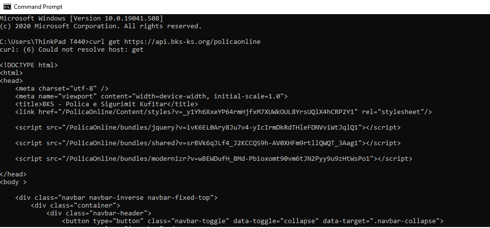

Ne menyre qe te realizohet mbushja e te dhenave ne webfaqen e deshiruar duhet qe te behet konfigurimi i Seleniumit si me poshte:
Konfigurimi i Seleniumit dhe marrja e paketave te caktura ne Visual Studio :
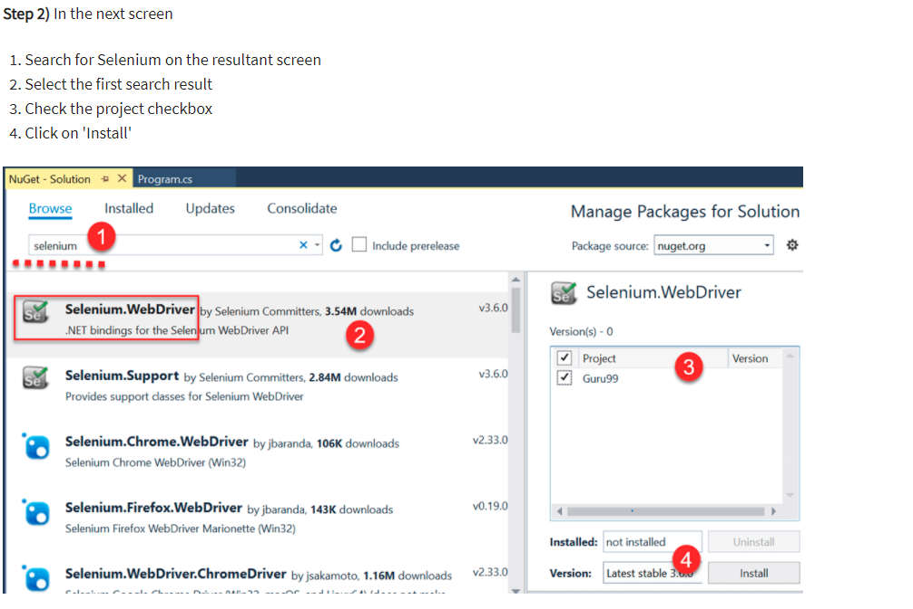
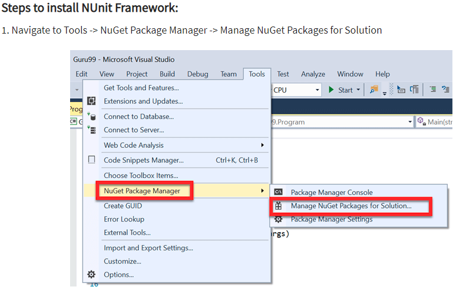
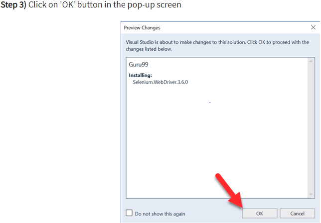
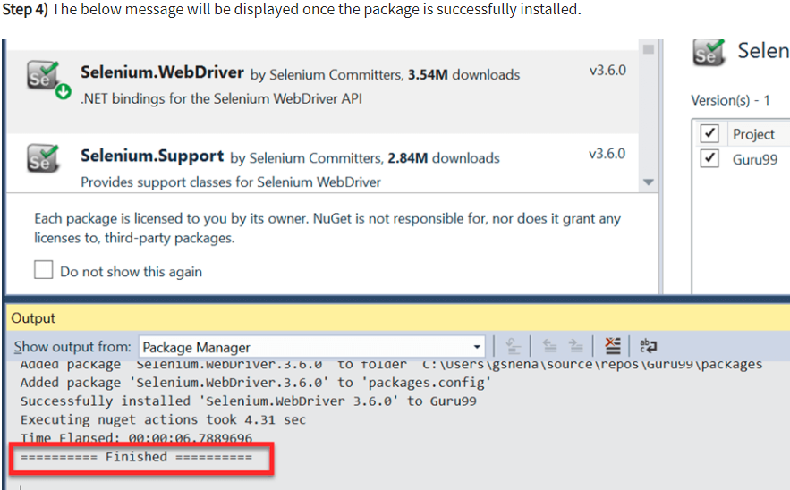
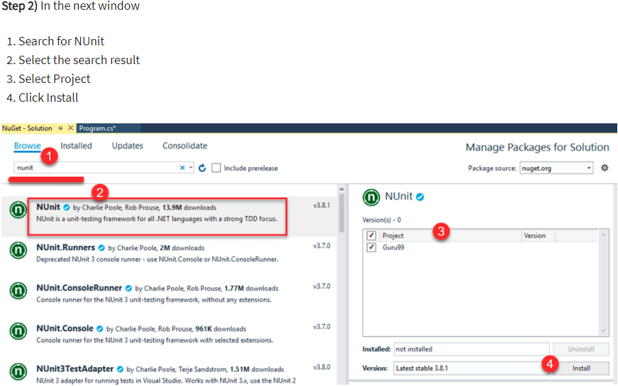
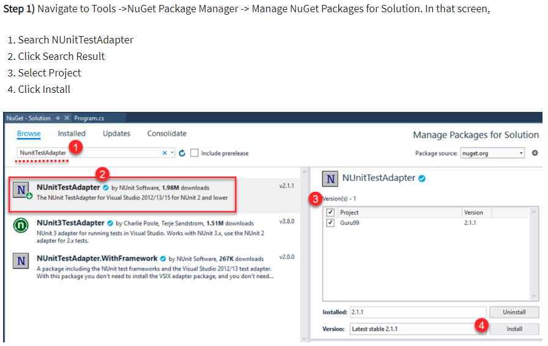
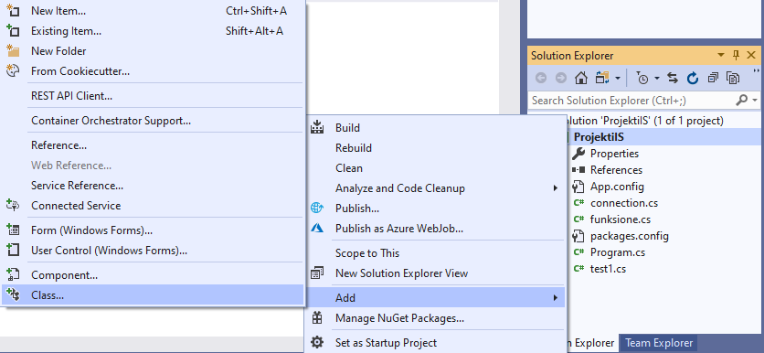
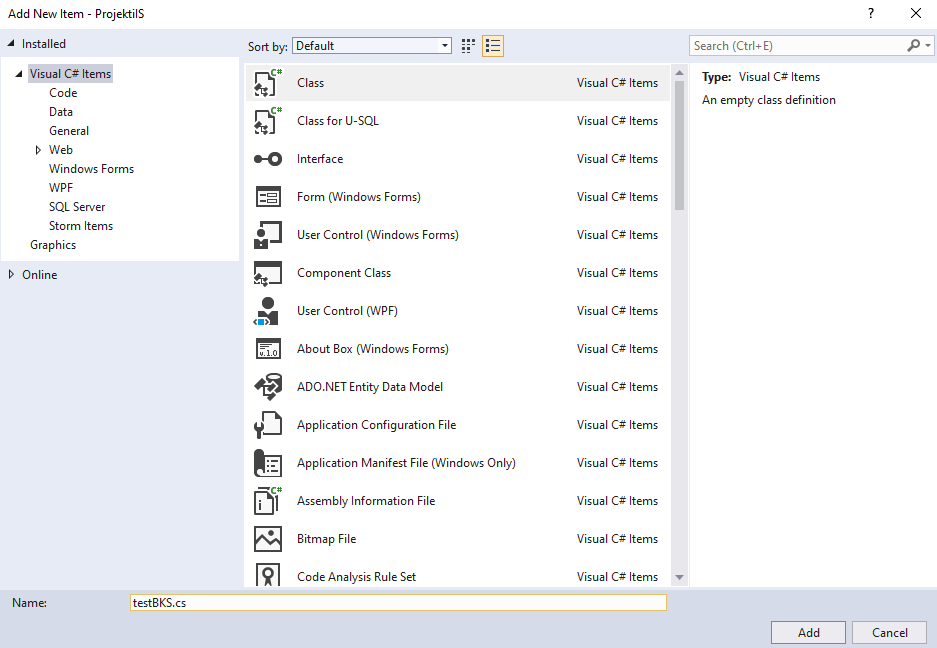
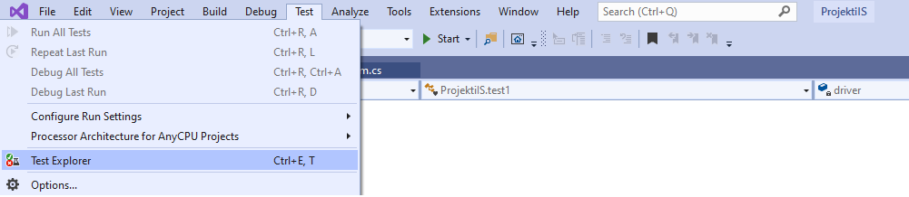
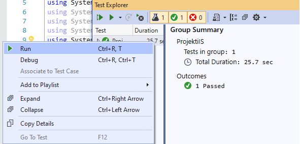

Referencat:
https://www.guru99.com/selenium-csharp-tutorial.html
https://www.guru99.com/introduction-to-selenium.html
https://www.selenium.dev/documentation/en/webdriver/keyboard/
http://seleniummaster.com/sitecontent/index.php/practice-tests/7-testing-form-with-selenium-code-sample-csharp
https://www.youtube.com/watch?v=T3q6QcCQZQg&feature=youtu.be&list=PL9ooVrP1hQOHYamtWSSlt5jF52WvP0cHl
